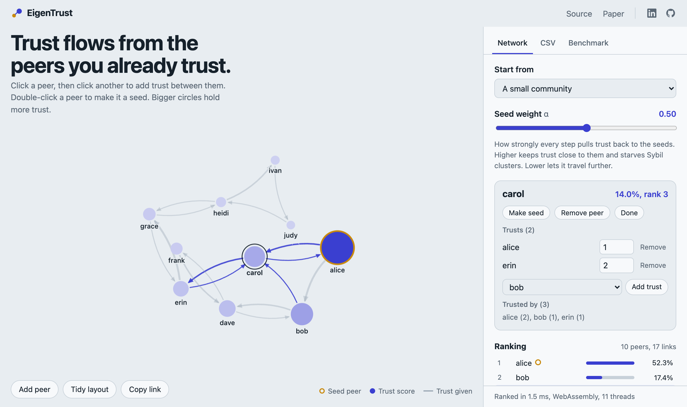

<h1 align="center">EigenTrust in Rust and WebAssembly</h1>

<p align="center">
  A fast implementation of the EigenTrust reputation algorithm.<br>
  Global trust scores for peer-to-peer networks, social graphs and web-of-trust systems, with Sybil attack resistance built in.
</p>

<p align="center">
  <a href="https://github.com/hypnagonia/eigentrust-rust/actions/workflows/ci.yml"></a>
  <a href="https://eigentrust.jenyadoesapps.com"></a>
  
  
</p>

<p align="center">
  <a href="https://eigentrust.jenyadoesapps.com"></a>
</p>

## What is EigenTrust?

EigenTrust turns local trust ("alice trusts bob") into a global reputation score for every peer. Trust spreads from a few seed peers you already trust, so fake accounts that only vouch for each other get almost nothing.

- **Input:** who trusts whom (`alice,bob,3`), plus seed peers.
- **Output:** a trust score for every peer. The scores add up to 1.
- **Algorithm:** power iteration on a sparse trust matrix, as in the [EigenTrust paper](https://nlp.stanford.edu/pubs/eigentrust.pdf) (Kamvar, Schlosser, Garcia-Molina, 2003). With no seeds it behaves like PageRank.

## Use cases

- Reputation systems for peer-to-peer and decentralized networks
- Sybil and spam resistance in social graphs and communities
- Ranking accounts, contributors or nodes by who vouches for them
- Web of trust and endorsement graphs

## Live demo

**[eigentrust.jenyadoesapps.com](https://eigentrust.jenyadoesapps.com)**: build a trust network, move the α slider and watch the ranking update. You can also rank 250,000 peers in the browser.

Available in English, Español, 中文, हिन्दी, العربية, Português, Français, Deutsch, Русский and 日本語.

## Quick start (CLI)

```sh
cargo run --release -- ./example/localtrust.csv ./example/pretrust.csv [alpha]
```

```
alice,0.6666666865348816
bob,0.3333333134651184
```

α defaults to `0.5`. A higher α keeps trust closer to the seeds.

## Use in the browser (WebAssembly)

```js
import init, { run } from './pkg/eigentrust.js'

await init()
const enc = new TextEncoder()
const result = JSON.parse(run(enc.encode('alice,bob,2\nbob,carol,1\n'), enc.encode('alice\n'), 0.5))
// { Ok: [["alice", ...], ["bob", ...], ["carol", ...]] }  or  { Err: "..." }
```

Build with `./build.sh`. For a ready-made Web Worker, see [`demo/worker.js`](demo/worker.js).

## Input format

| File | Line | Example |
| --- | --- | --- |
| Local trust | `from,to[,weight]` | `alice,bob,2` |
| Seeds (pre-trust) | `peer[,weight]` | `alice,1` |

- A header row is optional. Spaces, quoted fields, CRLF and a UTF-8 BOM are fine.
- Weights default to 1. Repeated `from,to` pairs: the last line wins.

## Performance

Random trust graphs, 10 links per peer, CSV parsing included.

| Peers | Links | CLI | Browser |
| ---: | ---: | ---: | ---: |
| 20,000 | 200,000 | 0.06 s | 58 ms |
| 100,000 | 1,000,000 | 0.4 s | 0.2 s |
| 250,000 | 2,500,000 | | 0.6 s |

The browser build is multithreaded when the page is cross-origin isolated (see [`demo/vercel.json`](demo/vercel.json)).

## Development

```sh
cargo test --release                  # tests
./build.sh                            # WASM builds, copied into demo/
python3 -m http.server -d demo        # run the playground locally
git config core.hooksPath .githooks   # once per clone
```
